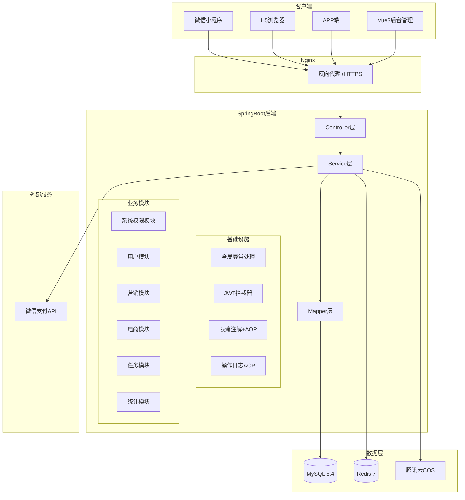

## 产品概述

NEOP是gongziyu.com旗下的商用任务营销+电商会员一体化系统，采用无余额资金池模式，核心业务为任务单独审核+后台授权打款+用户单笔微信提现。

## 核心功能

- **系统权限**：RBAC权限管理（菜单/角色/管理员/字典/配置/操作日志）
- **用户模块**：微信静默登录、用户信息、收货地址管理
- **营销模块**：会员套餐充值、积分签到、邀请体系（邀请奖励积分）
- **电商模块**：商品分类/商品/购物车/订单全链路，微信支付+回调
- **任务模块（核心）**：任务CRUD、领取、提交工单、审核、提现申请、后台授权打款
- **微信企业付款**：V2接口企业付款到零钱、回调、失败重试
- **数据统计**：每日统计+6个定时任务+后台数据看板
- **三端前端**：Vue3后台管理 + UniApp移动端（H5/小程序/APP）

## 技术栈

### 后端

- **语言/框架**：Java 21 + SpringBoot 3.2.5 + MyBatis-Plus 3.5.7
- **数据库**：MySQL 8.4（28张表，Flyway版本迁移）
- **缓存/锁**：Redis 7 + Redisson 3.27.0（Token黑名单、幂等校验、限流、分布式锁）
- **支付**：微信支付V2（weixin-java-pay 4.6.0，HMAC-SHA256签名，p12证书）
- **认证**：JWT（jjwt 0.11.5，HS256，移动端7天/后台2小时）
- **工具**：Hutool 5.8.25 + Lombok + FastJSON 2.0.48 + Jsoup 1.17.2
- **文件存储**：腾讯云COS（cos_api-bundle 5.6.155）/ 阿里云OSS（备选）
- **测试**：JUnit 5 + Mockito，覆盖率>=80%

### 前端

- **后台管理**：Vue3 + Vite 5 + Element Plus 2.7 + Pinia + Axios
- **移动端**：UniApp（Vue3 + Vite模板）+ uni-ui

## 实现方案

### 总体策略

按文档第十七章10个阶段严格顺序开发，每个阶段完成后输出Postman测试集合。后端先搭建基础设施（全局异常/JWT/限流/日志AOP），再按模块开发业务CRUD，最后开发前端对接接口。

### 关键技术决策

1. **Entity继承BaseEntity**：所有28张表实体继承BaseEntity（id/deleted/createTime/updateTime），使用MyBatis-Plus代码生成器+手动调整
2. **增删改查范式**：所有模块严格遵循第29章Controller-Service-Mapper分层模板，DTO接收参数+@Valid校验
3. **并发安全**：任务领取/电商下单用Redisson分布式锁，库存扣减用数据库乐观锁WHERE stock >= num
4. **事务边界**：审核+积分发放同事务；支付回调本地事务+Redis幂等+补偿；第三方调用在事务外执行
5. **微信支付V2**：使用weixin-java-pay SDK，企业付款接口+HMAC-SHA256签名+p12证书
6. **文件上传**：策略模式，通过neop.upload.type配置切换COS/OSS/本地

### 架构设计



### 目录结构

```
/Users/neo/Desktop/neop/
├── neop-backend/                          # [NEW] 后端Maven项目
│   ├── pom.xml                            # 依赖配置（第26章精确版本）
│   ├── src/main/java/com/gongziyu/neop/
│   │   ├── NeopApplication.java           # 启动类
│   │   ├── common/                        # Result/PageDTO/常量
│   │   ├── config/                        # Redis/Redisson/CORS/WebMvc配置
│   │   ├── entity/                        # 28张表实体（继承BaseEntity）
│   │   │   └── base/BaseEntity.java       # 公共字段基类
│   │   ├── dto/                           # 请求/响应DTO
│   │   ├── mapper/                        # MyBatis-Plus Mapper接口
│   │   ├── service/                       # 业务接口
│   │   ├── service/impl/                  # 业务实现
│   │   ├── controller/                    # 控制器（sys/user/marketing/trade/task/stat/wechat）
│   │   ├── exception/                     # BusinessException/WechatApiException/GlobalExceptionHandler
│   │   ├── annotation/                    # @RateLimit/@OperationLog自定义注解
│   │   ├── util/                          # JwtUtil/AesEncryptUtil/FileUploadUtil/XssUtil
│   │   └── task/                          # 6个定时任务
│   └── src/main/resources/
│       ├── application.yml                # 主配置
│       ├── application-dev.yml            # 开发环境
│       ├── application-prod.yml           # 生产环境
│       ├── cert/                          # 微信p12证书
│       ├── mapper/                        # 复杂SQL的XML映射
│       └── db/migration/                  # Flyway增量SQL（V1.0.0起）
├── neop-admin-web/                        # [NEW] Vue3后台管理
│   ├── vite.config.js
│   ├── src/
│   │   ├── main.js
│   │   ├── router/                        # 路由配置
│   │   ├── store/                         # Pinia状态管理
│   │   ├── api/                           # 接口请求封装
│   │   ├── views/                         # 页面（sys/user/marketing/trade/task/stat）
│   │   ├── utils/request.js              # Axios拦截器
│   │   └── components/                    # 公共组件
├── neop-uniapp/                           # [NEW] UniApp移动端
│   ├── pages.json                         # 页面路由
│   ├── manifest.json                      # 应用配置
│   ├── pages/                             # 页面（index/user/task/trade/common）
│   ├── utils/request.js                   # 统一请求封装（第31章模板）
│   ├── utils/upload.js                    # 文件上传工具
│   └── components/                        # 公共组件
└── dev-log/                               # 开发日志
```

## 实现注意事项

- **Flyway严格规范**：严禁修改已存在的SQL文件，所有变更必须新建V{x.x.x}__描述.sql
- **禁止余额/资金池**：所有现金奖励绑定单个任务工单，独立结算提现
- **事务内禁止第三方调用**：微信API调用必须在事务提交后执行
- **敏感数据**：密码BCrypt、手机号AES加密、接口返回脱敏
- **每阶段交付Postman集合**：正常流+异常流+边界流三场景
- **开发日志**：每次修改写入dev-log文件夹，文件名格式 日期+改动内容

## Agent Extensions

### Skill

- **writing-plans**: 在每个开发阶段开始前，用于细化该阶段的具体实施步骤，确保代码实现有明确的执行路径
- **executing-plans**: 用于按计划逐步执行开发任务，在关键节点设置审查检查点

### SubAgent

- **code-explorer**: 在开发过程中需要跨文件搜索模式、验证已有代码结构时使用